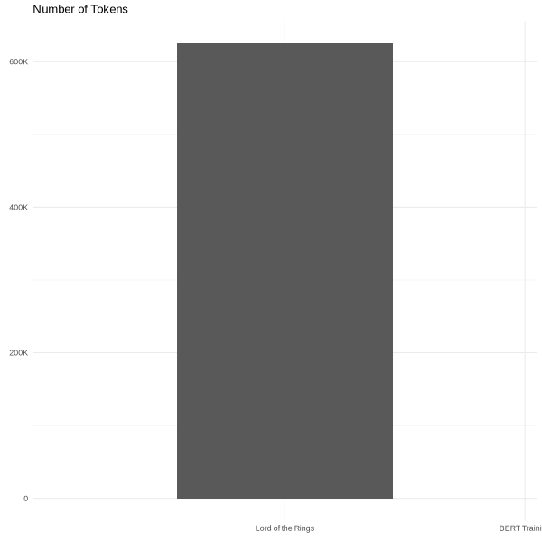
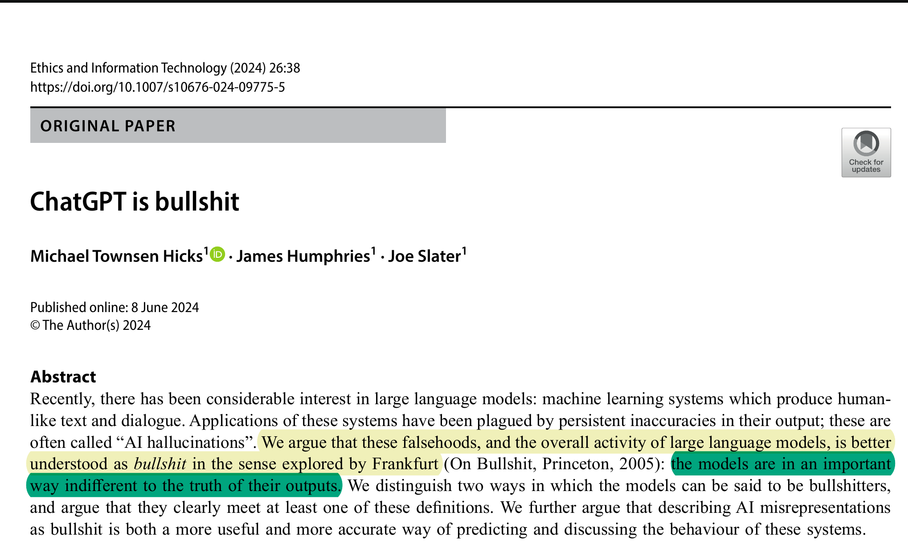
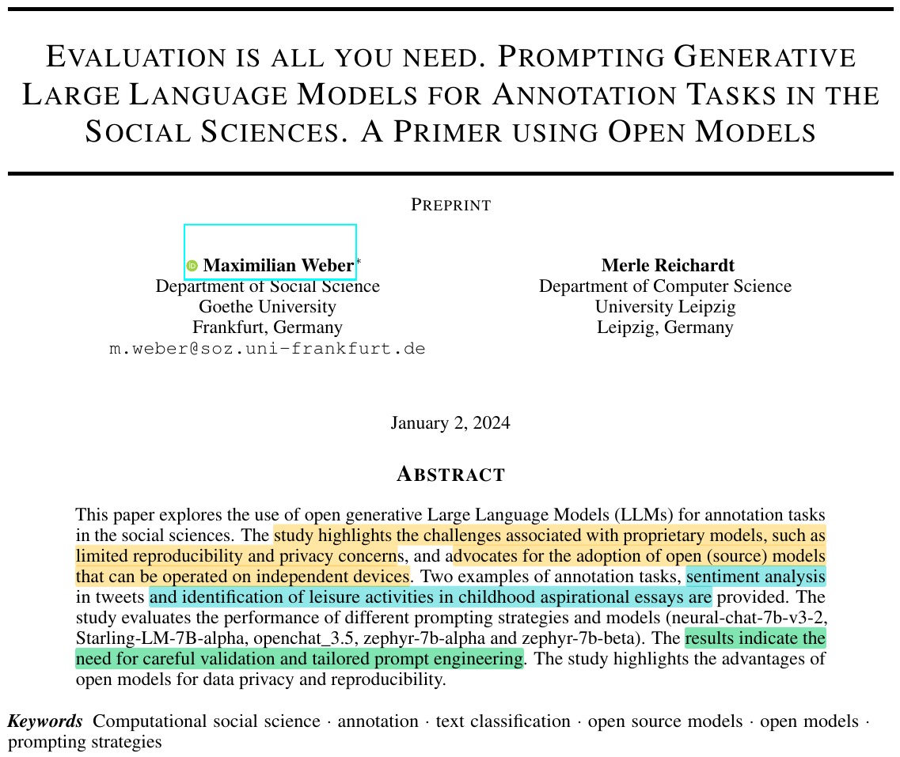
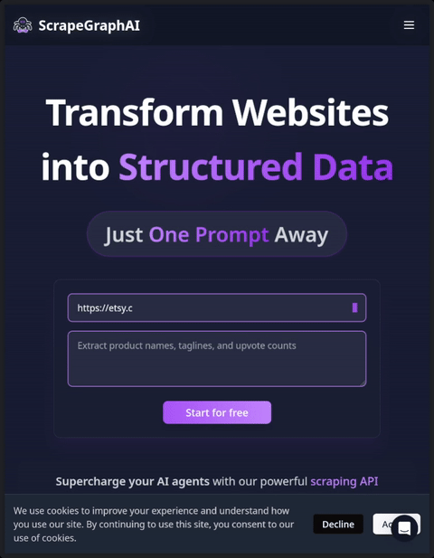
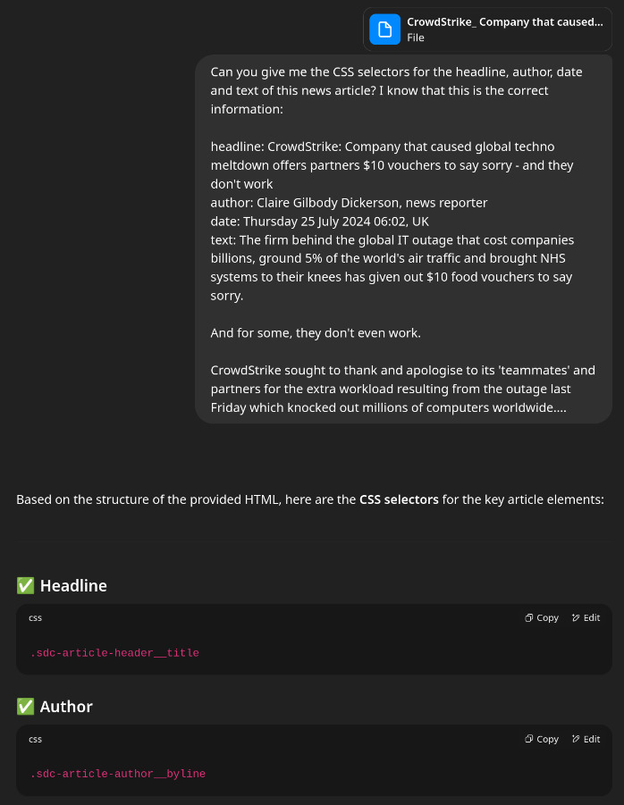
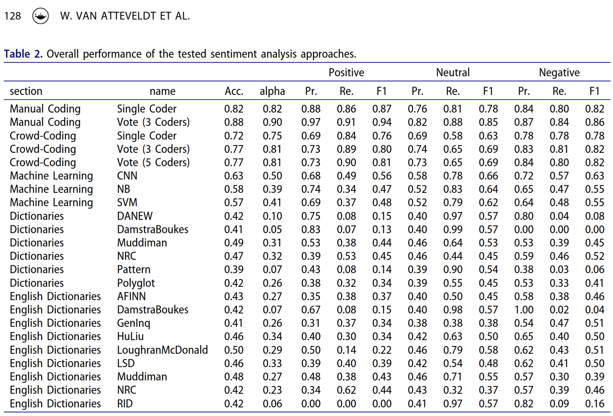
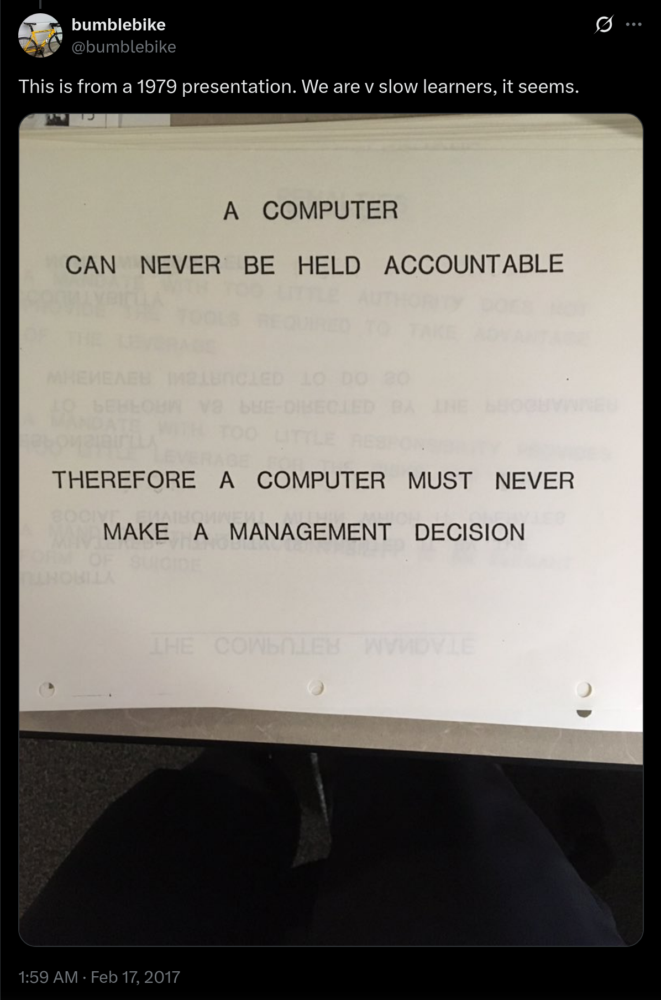

# Introduction
## Schedule: GESIS Fall Seminar in Computational Social Science

| time   | Session                                      |
|--------|----------------------------------------------|
| Day 1  | Introduction to Computational Social Science |
| Day 2  | Obtaining Data                               |
| Day 3  | Computational Text Analysis                  |
| Day 4  | Computational Network Analysis               |
| **Day 5**  | **Large Language Models in the Social Sciences** |

: Course Schedule {.striped .hover}

<!-- This is a comment. You can leave them here to take notes linked to the slides. -->

## The Plan for Today

:::: {.columns}

::: {.column width="60%"}
- Overview: what are LLMs (are they artificial intelligence?)
- How we can use them for Computational Social Science Research
- How can we use them for *Computational Text Analysis*
:::


::: {.column width="30%" }

[Maximalfocus](https://unsplash.com/@maximalfocusl) via unsplash.com
:::

::::

<!-- This is a comment. You can leave them here to take notes linked to the slides. -->

# What are Large Language Models?
## What are language models?


:::: {.columns}

::: {.column width="70%"}
[Language models are statistical representations of natural language that use machine learning to model relationships between words]{.kn-pink}

Examples:

- Supervised Machine Learning Models: text input → category output
- Unsupervised Machine Learning Models: relationship between words and words; words and texts; texts and texts
- Machine Translation Models: input text → output text
- Generative Language Models: fill in blanks in a sentence
:::


::: {.column width="30%"}
{width="100%"}
:::

::::


## Timeline language models

{width="80%"}

[Source: [Computational Analysis of Digital Communication](https://masurp.github.io/VU_CADC/)]{.nord-footer}

## Timeline language models {visibility="uncounted"}

{width="80%"}

[Source: [Computational Analysis of Digital Communication](https://masurp.github.io/VU_CADC/)]{.nord-footer}

## The initial problem of text analysis

-   Computers don't read text, they only can deal with numbers

-   For this reason, so far, we tokenized our texts (e.g., in words) and summarized their frequency across texts to create a document-feature matrix within the bag-of-words model


-   Such a text representation has some issues:

    -   Treats words as equally important (→ requires removal of noise, stopwords...)
    -   Ignores word order and context
    -   Results in a sparse matrix (→ computationally expensive)

## Alternative: Map words into a vector space


## What are embeddings?

- featuere-topic-matrix


This case makes it pretty clear:

- mice belong into the first topic
- cats belong into the second
- dogs belong into the third topic

## Pre-trained Word embeddings: GloVe

```{r}
#| echo: true
#| include: true
#| code-line-numbers: true
#| class-output: output
#| # Download Global Vector Embeddings with 10.000 words and 50 dimensions
library(tidyverse)
get_glove <- function(dir, dimensions = c(50, 100, 200, 300)) {
  # don't re-download files if present
  file <- file.path(dir, paste0("glove.6B.", dimensions, "d.txt"))
  cache_loc <- file.path(dir, "glove.6B.zip")
  if (!file.exists(file)) {    
    if (!file.exists(cache_loc)) {
      curl::curl_download("http://nlp.stanford.edu/data/glove.6B.zip", cache_loc, quiet = FALSE)
    }
    unzip(cache_loc, files = basename(file), exdir = "data")
  }
  # read and process glove vectors
  df <- data.table::fread(file, quote = "")
  colnames(df) <- c("term", paste0("dim", seq_len(ncol(df) - 1)))
  return(df)
}
glove_df <- get_glove("data", dimensions = 50)

# 10 highest scoring words on dimension 1
glove_df |> 
  arrange(-dim1) |> 
  select(1:10)
```

## Similarities between words

As mentioned before, we can compute similarity scores for word pairs:

```{r}
#| echo: true
#| include: true
#| code-line-numbers: true
#| class-output: output
nearest_neighbors <- function(tbl, word, n = 15) {
  
  comp <- filter(tbl, term == word)
  if (nrow(comp) < 1L) stop("word ", word, " not found in the embedding")
  sim <- proxyC::simil(as.matrix(select(comp, -term)), 
                       as.matrix(select(tbl, -term)), 
                       method = "cosine") # calculate cosine similarity
  # get the n highest values plus original word
  rank <- order(as.numeric(sim), decreasing = TRUE)[seq_len(n + 1)] 
  tibble(
    word = word,
    neighbor = tbl$term[rank],
    similarity = sim[1, rank]
  )
}
```

::: columns
::: {.column width="50%"}
```{r}
#| echo: true
#| include: true
#| code-line-numbers: true
#| class-output: output
#| output-location: fragment
nearest_neighbors(glove_df, "basketball")
```
:::

::: {.column width="50%"}
```{r}
#| echo: true
#| include: true
#| code-line-numbers: true
#| class-output: output
#| output-location: fragment
nearest_neighbors(glove_df, "netherlands")
```
:::
:::


## Similarity of entire sentences or texts

<!-- TODO: coming later -->
But we can also generalize word embeddings to entire sentences (or even texts):

```{r, R.options = list(width = 120)}
#| echo: true
#| include: true
#| code-line-numbers: true
#| class-output: output
library(rollama)

# Example sentences
movies <- tibble(sentences = c("This movie is great, I loved it.", 
                               "The film was fantastic, a real treat!",
                               "I did not like this movie, it was not great.",
                               "Today, I went to the cinema and watched a movie",
                               "I had pizza for lunch."))
                     
# Get embeddings from a sentence transformer
movie_embeddings <- embed_text(movies$sentences, model = "nomic-embed-text")

# Each text has now 768 values
movie_embeddings 
```

## The subtle similarity of some texts in the example

-   We can see that text 2 is most similar to text 1: Both express a very similar sentiment, just with different words ("great" ≈ "fantastic"; "I loved it" ≈ "A real treat")

-   Text 2 is still similar to text 3 (after all it is about movies), but less so compared to text 1 ("fantastic" is the opposite of "not great")

-   Text 4 still shares similarities (the context is the cinema/watching movies), but text 5 is very different as it doesn't contain similar words and is not about similar things (except "I").

```{r, R.options = list(width = 120)}
#| echo: true
#| include: true
#| code-line-numbers: true
#| class-output: output
sim <- proxyC::simil(as.matrix(movie_embeddings), as.matrix(movie_embeddings), method = "cosine")
colnames(sim) <- paste0("movie", 1:5)
cbind(movies, as_tibble(as.matrix(sim)))
```

## From Sparse to Dense Matrix Representation

-   Using embedding vectors instead of word frequencies further has the advantages of strongly reducing the dimensionality of the DTM: instead of (tens of) thousands of columns for each unique word we only need hundreds of columns for the embedding vectors (→ dense instead of sparse)

-   This means that further processing can be more efficient as fewer parameters need to be fit, or conversely that more complicated models can be used without blowing up the parameter space.

## What are transformers?

-   Until 2017, the state-of-the-art for natural language processing was using a deep neural network (e.g., recurrent neural networks, long short-term memory and gated recurrent neural networks)
-   In a preprint called "Attention is all you need" [@vaswani_attention_2017], published in 2017 and cited more than 95,000 times, the team of Google Brain introduced the so-called **Transformer**, a a neural network-type architecture that learns context and thus meaning by tracking relationships in sequential data like the words in this sentence.
-   Transformer models apply an evolving set of mathematical techniques, called **attention** or **self-attention**, to detect subtle ways even distant data elements in a series influence and depend on each other.


## Self-Attention

-   In general terms, self-attention works encodes how similar each word is to all the words in the sentence, including itself.

-   Once the similarities are calculated, they are used to determine how the transformers encodes each word.


## Self-Attention

-   In general terms, self-attention works encodes how similar each word is to all the words in the sentence, including itself.

-   Once the similarities are calculated, they are used to determine how the transformers encodes each word.


## Self-Attention

-   In general terms, self-attention works encodes how similar each word is to all the words in the sentence, including itself.

-   Once the similarities are calculated, they are used to determine how the transformers encodes each word.


## Self-Attention

-   In general terms, self-attention works encodes how similar each word is to all the words in the sentence, including itself.

-   Once the similarities are calculated, they are used to determine how the transformers encodes each word.


## So why are transformer models important?

::: columns
::: {.column width="60%"}
-   Transformer models apply an evolving set of mathematical techniques, called **attention** or **self-attention**, to detect subtle ways even distant data elements in a series influence and depend on each other.
- this actually simplifies learning:
  - No need for recurrent or convolutional network structures
  - Based solely on attention mechanism (stacked on top of one another)
  - Required less training time (can be parallelized)
- It thereby outperformed prior state-of-the-art models in a variety of tasks
- The transformer architecture is the back-bone of all current large language models and so far drives the entire *"AI revolution"*
:::

:::: {.column width="40%"}

:::
:::

## What are *Large* language models

::: columns
::: {.column .incremental width="50%"}
- *Large* language models are language models that are large
- Like the "big" in "big" data, the term is relative to what is considered at the time
- It refers to the training data, the parameter size, and the computational resources needed for training
- As models get larger, they approach what appears like general-purpose language understanding
- Current generations of LLMs are still just a type of artificial neural networks (mainly transformers!) and are (pre-)trained using self-supervised learning and semi-supervised learning
:::

::: {.column width="50%"}
```{r model-sizes}
#| echo: false
if (!file.exists("media/model_size.gif")) {
  library(gganimate)
  library(tidyverse)
  # quick animation to show evolution of training data sizes
  token_counts <- tibble(
    labels = fct_inorder(c('Lord of the Rings', 'BERT Training', 'GPT-3 Training', 'Llama 4 Training')),
    tokens = c(625000, 156000000000, 300000000000, 40000000000000),
    time = 1:4
  ) |> 
    # add some frames at the end to show Llama longer
    complete(time = 5:6, fill = list(labels = 'Llama 4 Training',
                                    tokens = 40000000000000))
  
  
  anim <- ggplot(token_counts, aes(x = labels, y = tokens)) +
    geom_col() +
    labs(x = NULL, y = NULL, title = "Number of Tokens") +
    theme_minimal() +
    scale_y_continuous(labels = scales::label_number(scale_cut = scales::cut_short_scale())) +
    # animate the plot
    transition_reveal(time) +
    view_follow()
  
  anim_save(
    filename = "media/model_size.gif", 
    animation = anim,
    duration = 20, 
    fps  =  30, 
    rewind = TRUE, 
    renderer = gifski_renderer(),
    height = 600, 
    width = 600
  )
}
```

:::
::::


## What are *generative* large language models

- trained to predict/generate next word in a conversation
- surprisingly good at emulating humans to complete tasks
- can be controlled with natural language
- have become very popular through ChatGPT (a browser interface to communicate with OpenAI's GPT models)

](https://jalammar.github.io/images/gpt3/06-gpt3-embedding.gif)


## Next token prediction

{.absolute height="80%" bottom=0}
{.absolute .fragment height="80%" bottom=0}

## Model categories 


## Technical things aside...

::: columns
::: {.column .incremental width="50%"}
- LLMs are probabilistic, not deterministic
- LLMs are "stochastic parrots" mimicking human speech patterns observed in their training corpus [@bender_dangers_2021]
:::

::: {.column width="50%"}
[](https://www.bizarro.com/blog/2025/4/27/prisoner-of-mimicry)
:::
::::

## Technical things aside... {visibility="uncounted"}

::: columns
::: {.column width="50%"}
- LLMs are probabilistic, not deterministic
- LLMs are "stochastic parrots" mimicking human speech patterns observed in their training corpus [@bender_dangers_2021]
- [LLMs are trained to please and sound confident and eloquent]{.fragment}
- [LLMs of "hallucinate" (or *bullshit* [@frankfurt_bullshit_2005])]{.fragment}
:::

::: {.column width="50%"}

:::
::::

## Technical things aside... {visibility="uncounted"}

::: columns
::: {.column width="50%"}
- LLMs are probabilistic, not deterministic
- LLMs are "stochastic parrots" mimicking human speech patterns observed in their training corpus [@bender_dangers_2021]
- LLMs are trained to please and sound confident and eloquent
- LLMs of "hallucinate" (or *bullshit* [@frankfurt_bullshit_2005])
- ["All quantitative models of language are wrong—but some are useful” [@grimmer_text_2013]]{.fragment}
:::

::: {.column width="50%"}

:::
::::


# How can we use LLMS for Computational Social Science Research
## Some use cases

:::: {.columns}
::: {.column .incremental width="60%"}
- Survey Research: Automated coding and response generation
- Experimental Studies: Creating stimuli and analyzing responses
- Hypothesis Generation: Theory development assistance
- Interview Analysis: Qualitative data coding
- Content Analysis: Processing large text datasets
- Writing and editing
- Literature review
- Programming
:::
::: {.column width="30%" }

[Maximalfocus](https://unsplash.com/@maximalfocusl) via unsplash.com
:::
::::


## Example: Using 'AI' web scrapers

Essentially two kinds of 'AI' web scrapers:

:::: {.columns }
::: {.column width="60%" .incremental}
### 'AI' parsers

- download html of a website
- prompt 'AI' to extract certain information and return in a good structure 

[advantages :heavy_plus_sign::]{.fragment}

+ no scraping skills needed whatsoever
+ can deal with complicated structures

[disadvantages :heavy_minus_sign::]{.fragment}

- expensive (computational, time, but also :money_with_wings:)
- does not scale well
- limit on the length of html content (depends on model context)
- potential for hallucination

:::{.fragment}
verdict:

:point_right: don't believe the hype, skip this one
:::
:::
::: {.column width="40%" }

:::
::::


## Using 'AI' web scrapers  {visibility="uncounted"}

Essentially two kinds of 'AI' web scrapers:

:::: {.columns}
::: {.column width="40%"}


:::
::: {.column width="60%" .incremental}
### 'AI' **written** parsers

- download html of a website
- prompt 'AI' to extract appropriate CSS selectors / write R code

[advantages :heavy_plus_sign::]{.fragment}

+ only **some** scraping skills needed
+ can deal with complicated structures
+ scales well

[disadvantages :heavy_minus_sign::]{.fragment}

- potential for hallucination (and inaccuracies)
- limit on the length of html content (depends on model context)

:::{.fragment}
verdict:

:point_right: try to use them (but with tests and caution!)
:::
:::
::::

## Using 'AI' web scrapers  {visibility="uncounted"}

Essentially two kinds of 'AI' web scrapers:

:::: {.columns}
::: {.column width="55%"}
### 'AI' parsers

- download html of a website
- prompt 'AI' to extract certain information and return in a good structure 

advantages :heavy_plus_sign::

+ no scraping skills needed whatsoever
+ can deal with complicated structures

disadvantages :heavy_minus_sign::

- expensive (computational, time, but also :money_with_wings:)
- does not scale well
- limit on the length of html content (depends on model context)
- potential for hallucination

verdict:

:point_right: don't believe the hype, skip this one
:::
::: {.column width="45%"}
### 'AI' **written** parsers

- download html of a website
- prompt 'AI' to extract appropriate CSS selectors / write R code

advantages :heavy_plus_sign::

+ only **some** scraping skills needed
+ can deal with complicated structures
+ scales well

disadvantages :heavy_minus_sign::

- potential for hallucination (and inaccuracies)
- limit on the length of html content (depends on model context)

verdict:

:point_right: try to use them (but with tests and caution!)
:::
::::

## Example: Using 'AI' for programming

:::: {.columns}
::: {.column width="55%"}
### Let 'AI' write your code (aka. vibe coding)

- prompt 'AI' to write your application/analysis code for you

advantages :heavy_plus_sign::

+ no programming skills needed whatsoever to write the code
+ can produce software with some *impressive* features

disadvantages :heavy_minus_sign::

- you need to understand programming logic to prompt effectivly
- if something goes wrong, this is very hard to fix
- you might not even realize many of the issue

verdict:

:point_right: don't believe the hype, being able to read+write code is still an important skill
:::
::: {.column .fragment width="45%"}
### Let 'AI' **help** you write code

- you know what code you need / what it needs to do and which language packages you want to use
- you prompt 'AI' to write a first draft of the code for you

advantages :heavy_plus_sign::

+ only **some** programming skills needed to write the code
+ can speed up your programming
+ can help you with "busy work" (writing documentation and comments)

disadvantages :heavy_minus_sign::

- instead of writing code, you spend most of your time reviewing and debugging code
- difficult to know in advance when it will save or waste time

verdict:

:point_right: try to use them (but with tests and caution!)
:::
::::


::: {.callout-tip .fragment}
- [GitHub Copilot in RStudio](https://docs.posit.co/ide/user/ide/guide/tools/copilot.html)
- [Gitingest](https://gitingest.com)
- [LLM code assist with RStudio and Positron](https://www.tidyverse.org/blog/2025/01/experiments-llm/)
:::

# How can we use them for *Computational Text Analysis*
## Why use gLLMs? 

::: {.smaller}
- cheaper to use 💸 (experts > research assistants > crowd workers > gLLMs)
- more accurate 🧠 (experts > research assistants > gLLMs > crowd workers)
- better at annotating complex categories 🤔 (human* > gLLM > LLM > SML)
- can use contextual information (human* > gLLM > LLM > ❌ SML)
- multilingual^[but still need of validation!]
- easier* to use: plain English prompting

[e.g., @GilardiChatGPT2023;@Heseltine_Hohenberg_2023;@Zhong_ChatGPT_2023;@Törnberg_2023]
:::

## How do you work with them - simple example

:::: {.columns}

::: {.column width="50%"}
### OpenAI GPT via API

```{r askgpt}
#| eval: false
library(askgpt)
options(askgpt_chat_model = "gpt-4")
askgpt("What are generative Large Language Models?")
#> ── Answer ────────────────────────────────────────────────────────
#> Generative Large Language Models are artificial
#> intelligence models that generate human-like text.
#> They are designed to understand and predict human 
#> language patterns. GPT-3 by OpenAI is a good 
#> example of a Generative Large Language Model. 
#> They can generate stories, poems, or even technical
#> content.
#>
#> These models are 'generative' because they create 
#> (or generate) new content. They are 'large' because
#> they are trained on large amounts of data, and the 
#> term 'language model' is due to their ability to 
#> use and understand human language. They learn to 
#> produce text by being fed huge amounts of existing 
#> text data, learning patterns and context from that 
#> data, and using this understanding to create new, 
#> relevant text that follows the rules of the 
#> language it was trained on. 
```
:::

::: {.column .fragment width="50%"}
### Running model locally through Ollama

```{r rollama}
#| eval: false
library(rollama)
query("What are generative Large Language Models?", model = "llama3:8b")
#> ── Answer from llama3:8b───────────────────────────────────────────
#> 
#> Generative large language models (LLMs) are a type
#> of artificial intelligence (AI) model that is
#> capable of generating new, > original text or
#> language based on patterns and structures learned
#> from large datasets. These models have become
#> increasingly popular in recent years due to their
#> ability to generate human-like text, respond to
#> questions, and even create entire stories.
#> 
#> Here's how they work: 
#> 
#> 1. **Training**: Generative LLMs are trained on 
#> massive amounts of text data, which can be sourced
#> from various places like books, articles, social
#> media, or online forums. 
#> 2. **Language patterns**: The models analyze the training data to identify patterns,
#> relationships, and structures in language. This
#> helps them learn how to generate new text that is
#> coherent, natural-sounding, and meaningful.
#> 3. **Generator**: The trained model has a generator
#> component that produces new text based on the
#> learned patterns. This can be done by sampling
#> from probability distributions or using techniques
#> like autoregressive models.
#> 4. **Conditioning**: To control the output of the 
#> model, conditioning mechanisms are used to specify
#> what kind of text should be generated. For example,
#> you might provide a prompt or topic for the model
#> to generate text about. 
#> 
#> Some key characteristics of generative LLMs include:
#> 
#> 1. **Autoregressive**: Generative models predict 
#> the next token in a sequence (e.g., word) based on 
#> the previous tokens.
#> 2. **Probabilistic**: The models assign 
#> probabilities to each possible output, allowing 
#> them to generate diverse and creative text.
#> 3. **Adversarial training**: Some models are trained
#> using adversarial examples, which helps them learn
#> to generate text that is more realistic and
#> challenging for humans to distinguish from
#> human-written text. 
#> 
#> Applications of generative LLMs:
#> 
#> 1. **Text generation**: These models can
#> be used to generate text for various purposes, such
#> as chatbots, customer service > responses, or
#> content marketing.  
#> 2. **Language translation**:
#> Generative LLMs can be fine-tuned for language
#> translation tasks, allowing them to translate text
#> from one language to another.
#> 3. **Content
#> creation**: They can help generate new ideas,
#> stories, or scripts by providing a starting point
#> and then > continuing the narrative.
#> 4. **Summarization**: Generative models can summarize
#> long pieces of text into shorter summaries while
#> preserving the original meaning.
#> 
#> Some popular examples of generative LLMs include: 
#> 
#> 1. **OpenAI's GPT-3**: A highly advanced language 
#> model capable of generating human-like text and 
#> responding to questions. 
#> 2. **Google's BERT**: A transformer-based model 
#> that has achieved state-of-the-art results in 
#> various natural language processing (NLP) tasks, 
#> including sentiment analysis and question answering.
#> 
#> These models have the potential to revolutionize 
#> many areas, from customer service and content 
#> creation to creative writing and > education.
#> However, they also require careful consideration 
#> of their ethical implications and limitations.
```
:::

::::


## Classification--Strategies

::: {style="font-size: 50%;"}
| Prompting Strategy | Example Structure |
|--------------------|--------------------|
| Zero-shot          | `{"role": "system", "content": "Text of System Prompt"},`<br>`{"role": "user", "content": "(Text to classify) + classification question"}` |
| One-shot           | `{"role": "system", "content": "Text of System Prompt"},`<br>`{"role": "user", "content": "(Example text) + classification question"},`<br>`{"role": "assistant", "content": "Example classification"},`<br>`{"role": "user", "content": "(Text to classify) + classification question"}` |
| Few-shot           | `{"role": "system", "content": "Text of System Prompt"},`<br>`{"role": "user", "content": "(Example text) + classification question"},`<br>`{"role": "assistant", "content": "Example classification"},`<br>`{"role": "user", "content": "(Example text) + classification question"},`<br>`{"role": "assistant", "content": "Example classification"},`<br>`. . . more examples`<br>`{"role": "user", "content": "(Text to classify) + classification question"}` |
| Chain-of-Thought   | `{"role": "system", "content": "Text of System Prompt"},`<br>`{"role": "user", "content": "(Text to classify) + reasoning question"},`<br>`{"role": "assistant", "content": "Reasoning"},`<br>`{"role": "user", "content": "Classification question"}` |
: Prompting strategies {.striped .hover tbl-colwidths="[15,85]"}
:::

See: @weber2023evaluation


## Classification--Zero-shot {.scrollable}

```{r}
q <- tribble(
  ~role,    ~content,
  "system", "You assign texts into categories. Answer with just the correct category.",
  "user",   "text: the pizza tastes terrible\ncategories: positive, neutral, negative"
)
query(q)
```

## Classification--One-shot {.scrollable}

```{r}
q <- tribble(
  ~role,    ~content,
  "system", "You assign texts into categories. Answer with just the correct category.",
  "user", "text: the pizza tastes terrible\ncategories: positive, neutral, negative",
  "assistant", "Category: Negative",
  "user", "text: the service is great\ncategories: positive, neutral, negative"
)
query(q)
#> 
#> ── Answer ────────────────────────────────────────────────────────
#> Category: Positive
```

:::{.fragment}

Neat effect: change the output structure

```{r}
#| classes: .fragement .fade-in
#| code-line-numbers: "5,11"
q <- tribble(
  ~role,    ~content,
  "system", "You assign texts into categories. Answer with just the correct category.",
  "user", "text: the pizza tastes terrible\ncategories: positive, neutral, negative",
  "assistant", "{'Category':'Negative','Confidence':'100%','Important':'terrible'}",
  "user", "text: the service is great\ncategories: positive, neutral, negative"
)
answer <- query(q)
#> 
#> ── Answer ────────────────────────────────────────────────────────
#> {'Category':'Positive','Confidence':'100%','Important':'great'}
```

:::

## Classification--Few-shot

```{r}
q <- tribble(
  ~role,    ~content,
  "system", "You assign texts into categories. Answer with just the correct category.",
  "user", "text: the pizza tastes terrible\ncategories: positive, neutral, negative",
  "assistant", "Category: Negative",
  "user", "text: the service is great\ncategories: positive, neutral, negative",
  "assistant", "Category: Positive",
  "user", "text: I once came here with my wife\ncategories: positive, neutral, negative",
  "assistant", "Category: Neutral",
  "user", "text: I once ate pizza\ncategories: positive, neutral, negative"
)
query(q)
```

## Classification--Chain-of-Thought {.scrollable}

```{r}
#| code-line-numbers: "4,11-12"
q_thought <- tribble(
  ~role,    ~content,
  "system", "You assign texts into categories. ",
  "user",   "text: the pizza tastes terrible\nWhat sentiment (positive, neutral, or negative) would you assign? Provide some thoughts."
)
output_thought <- query(q_thought)
```

:::{.fragment}
Now we can use these thoughts in classification

```{r}
#| echo: true
#| eval: false
#| code-line-numbers: "6"
q <- tribble(
  ~role,    ~content,
  "system", "You assign texts into categories. ",
  "user",   "text: the pizza tastes terrible\nWhat sentiment (positive, neutral, or negative) would you assign? Provide some thoughts.",
  "assistant", pluck(output_thought, "message", "content"),
  "user",   "Now answer with just the correct category (positive, neutral, or negative)"
)
query(q)
```
:::


## Example: Sentiment Analysis

:::: {.columns}

::: {.column width="50%"}
- gLLMs often perform better on standard text classification problems
- Let's put this to a test with data from @Atteveldt_sentiment_2021
- What do they do? Compare trained human annotators, crowd-coding, dictionary approaches, and supervised machine learning algorithms (including deep learning) on Dutch sentiment
:::

::: {.column width="50%"}

:::
::::

## The Setup

:::: {.columns}

::: {.column width="50%"}
### Get the data

```{r sentiment_data}
#| warning: false
sentiment_data <- "https://raw.githubusercontent.com/vanatteveldt/ecosent/master/data/intermediate/sentences_ml.csv" |>
  read.csv() |>
  dplyr::filter(gold)
```
:::

::: {.column .fragment width="50%"}
### define queries and an output schema.

```{r queries}
queries_list <- make_query(
  text = sentiment_data$headline,
  prompt = "Annotate the sentiment in this text"
)

output_schema <- list(
  "object",
  properties = list(
    sentiment = list(
      type = "string",
      enum = c("negative", "neutral", "positive")
    )
  ),
  required = "sentiment"
)
```

- Using the structured output, we can make sure it is easy to process the results.
:::
::::

## Testing the setup

```{r}
query(
  queries_list[1],
  model = "llama3.2:3b-instruct-q8_0",
  screen = FALSE, # turn off priting answers
  model_params = list(seed = 42),
  output = "text",
  format = output_schema
) |>
  purrr::map(jsonlite::fromJSON) |>
  purrr::map_chr("sentiment")
```

## Comparing a few models

```{r}
#| style: "max-height: 1000px;"
extract_sentiment <- function(resp) {
  saveRDS(resp, "resp.rds")
  resp |>
    purrr::map_chr(c("message", "content")) |>
    purrr::map(jsonlite::fromJSON) |>
    purrr::map_chr("sentiment", .default = "")
}

extract_time <- function(resp) {
  purrr::map_dbl(resp, "eval_duration") * 1e-9
}

pb <- list(
  format = c("{cli::pb_spin} {cli::pb_percent} done [ETA: {cli::pb_eta}]")
)

bench_file <- "data/sentiment_bench.rds"
if (file.exists(bench_file)) {
  bench <- readRDS(bench_file)
} else {
  bench <- sentiment_data |>
    tidyr::expand_grid(
      model = c(
        "llama2:7b",
        "llama3:8b",
        "llama3.1:8b",
        "llama3.2:3b",
        "llama3.2:3b-instruct-q8_0",
        "llama3.3:70b",
        "llama3.1:70b-instruct-q5_1",
        "deepseek-r1:7b",
        "deepseek-r1:8b",
        "deepseek-r1:14b",
        "qwen2.5:7b",
        "gemma:2b",
        "gemma:7b",
        "gemma2:9b",
        "deepseek-r1:1.5b",
        "smollm2:latest",
        "qwq:32b"
      )
    ) |>
    dplyr::arrange(model) |>
    dplyr::mutate(
      query = make_query(
        text = headline,
        prompt = "Annotate the sentiment in this text"
      ),
      resp = query(
        query,
        model = model,
        screen = FALSE, # turn off printing answers
        model_params = list(seed = 42),
        output = "response",
        verbose = pb,
        format = output_schema
      ),
      sentiment = extract_sentiment(resp),
      eval_time = extract_time(resp)
    )
  saveRDS(bench, bench_file)
}

benchmark_data <- bench |>
  mutate(
    annotation_human = c("negative", "neutral", "positive")[value + 2],
    annotation_human = as.factor(annotation_human),
    sentiment = ifelse(sentiment == "", NA_character_, sentiment),
    sentiment = as.factor(sentiment)
  )
```

## Results

```{r tbl-sentiment}
#| eval: true
#| warning: false
#| echo: false
#| tbl-cap: "Performance of the tested models for sentiment analysis on data from @Atteveldt_sentiment_2021"
library(yardstick)
library(tidyverse)
library(gt)
ml_metrics <- metric_set(accuracy, precision, recall, f_meas)

benchmark_data |>
  group_by(model) |>
  ml_metrics(truth = annotation_human, estimate = sentiment) |>
  ungroup() |>
  select(-.estimator) |>
  pivot_wider(
    id_cols = model,
    names_from = .metric,
    values_from = .estimate
  ) |>
  arrange(f_meas) |>
  gt() |>
  data_color(
    columns = where(is.numeric),
    fn = scales::col_numeric(
      palette = c("red", "orange", "green"),
      domain = c(0, 1)
    )
  ) |>
  fmt_number(decimals = 2, drop_trailing_zeros = TRUE)
```


## Example: Improved machine learning

- We saw earlier that these models can produce embeddings for full texts
- These texts are dense representations of the "meaning" of text
- We can use them to improve supervised machine learning approaches

## The Setup

:::: {.columns}

::: {.column width="50%"}
### Get the data

```{r}
set.seed(1)
reviews <- readRDS("data/imdb.rds") # |>
  # sample to make this quicker
  # slice_sample(n = 5000)
```
:::

::: {.column .fragment width="50%"}
### Turn them into embeddings

```{r embeddings}
#| eval: false
reviews_embeddings <- reviews |>
  mutate(embeddings = embed_text(text = text, model = "nomic-embed-text")) |>
  select(id, label, embeddings) |>
  unnest_wider(embeddings)
reviews_embeddings |> 
  select(1:10)
```

```{r}
#| eval: true
#| echo: false
# saveRDS(reviews_embeddings, "data/reviews_embeddings.rds")
readRDS("data/reviews_embeddings.rds") |> 
  select(1:10)
```
:::
::::

## Use tidymodels

```{r smldemo}
#| style: "max-height: 1000px;"
#| eval: false
library(tidymodels)
# split data into training an test set (for validation)
set.seed(1)
reviews_split <- initial_split(reviews_embeddings)

reviews_train <- training(reviews_split)

# set up the model we want to use
lasso_spec <- logistic_reg(penalty = tune(), mixture = 1) |>
  set_engine("glmnet")

# we specify that we want to do some hyperparameter tuning and bootstrapping
param_grid <- grid_regular(penalty(), levels = 50)
reviews_boot <- bootstraps(reviews_train, times = 10)

# and we define the model. Here we use the embeddings to predict the rating
rec_spec <- recipe(label ~ ., data = select(reviews_train, -id))

# bringing this together in a workflow
wf_fh <- workflow() |>
  add_recipe(rec_spec) |>
  add_model(lasso_spec)

# now we do the tuning
set.seed(42)
lasso_grid <- tune_grid(
  wf_fh,
  resamples = reviews_boot,
  grid = param_grid
)

# select the best model
wf_fh_final <- wf_fh |>
  finalize_workflow(parameters = select_best(lasso_grid, metric = "roc_auc"))

# and train a new model + predict the classes for the test set
final_res <- last_fit(wf_fh_final, reviews_split)

# we extract these predictions
final_pred <- final_res |>
  collect_predictions()
```

```{r}
#| eval: true
#| echo: false
# saveRDS(final_pred, "data/final_pred.rds")
final_pred <- readRDS("data/final_pred.rds")
```

## Check out results

```{r}
library(gt)
my_metrics <- metric_set(accuracy, kap, precision, recall, f_meas)

my_metrics(final_pred, truth = label, estimate = .pred_class) |> 
  # I use gt to make the table look a bit nicer, but it's optional
  gt() |> 
  data_color(
    columns = .estimate,
    fn = scales::col_numeric(
      palette = c("red", "orange", "green"),
      domain = c(0, 1)
    )
  )
```

[Comparison to day-3: F1 = 0.72 and 0.71]{.kn-pink}

# Conclusion
## Conclusion

:::: {.columns}
::: {.column width="50%"}
- LLMs bring many new possibilities for new research
- A lot of it is untested and comes with risks
- If you want to use models, think about: responsibility
- Trust but verify!
:::

::: {.column .fragment width="50%"}

:::
::::

# References
